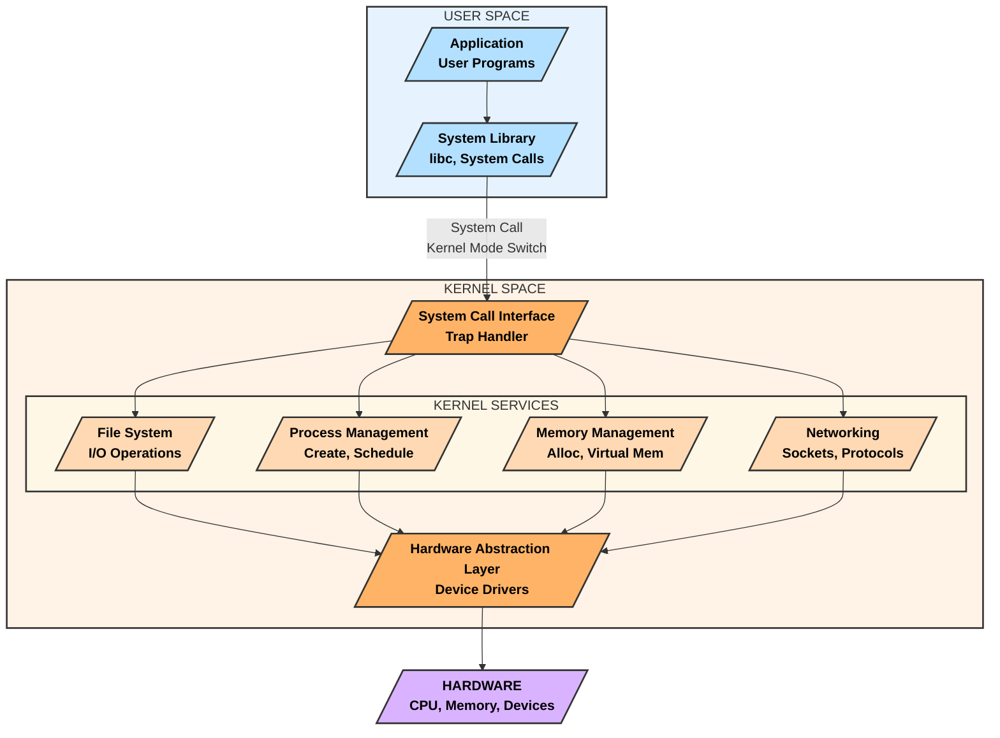

## Understanding Syscalls from Scratch
### What are Syscalls?
Syscalls (short for **System Calls**) are the interface between user-space applications and the operating system kernel. They allow programs to request services such as file operations, process control, memory management, and networking from the kernel.

When a user-space program needs to perform a privileged operation (like reading a file or sending data over the network), it cannot directly interact with the hardware. Instead, it makes a syscall to request the kernel to do it on its behalf.



### How Syscalls Work?
**User-space program makes a syscall** – The program requests a kernel service by calling a function from the **C standard library (glibc)** or directly using assembly.

**The request enters the kernel mode** – The CPU transitions from user mode to kernel mode using a special instruction like `int 0x80`, `syscall`, or `sysenter` (depending on the architecture).

**The kernel performs the requested operation** – The OS kernel checks the syscall number and executes the corresponding handler.

**Results are returned to the user-space program** – The kernel switches back to user mode and passes the result to the calling program.
### Basic Example of a Syscall (Using `write`)
The `write` syscall is used to write data to a file descriptor.
#### *C Program Example
```c
#include <unistd.h>
int main() {
    const char *msg = "Hello, Syscalls!\n";
    write(1, msg, 17); // 1 is the file descriptor for stdout
    return 0;
}
```
Here, `write()` is a syscall that writes the message to **stdout (file descriptor 1)**.
It directly invokes the kernel to perform this operation.

## What is `strace`?
`strace` (System Trace) is a debugging tool in Linux that captures and logs system calls made by a process. It helps in: 
- Understanding how a program interacts with the OS. 
- Debugging errors related to file access, networking, memory allocation, etc. 
- Identifying performance bottlenecks. 

## How `strace` Works
When a program runs, it makes **system calls** (syscalls) to interact with the kernel. `strace` intercepts these syscalls and prints them in a human-readable format. 

## **Basic Usage** 
To trace a command: 
```bash
strace ls
```
Output:
```
execve("/bin/ls", ["ls"], 0x7ffef... ) = 0
brk(NULL)                               = 0x5634e000
access("/etc/ld.so.preload", R_OK)      = -1 ENOENT (No such file or directory)
openat(AT_FDCWD, "/etc/ld.so.cache", O_RDONLY|O_CLOEXEC) = 3
...
write(1, "file1  file2\n", 12)          = 12
exit_group(0)                           = ?
```
Each line represents a syscall made by `ls`. 
The format is:
  ```
  syscall_name(args) = return_value
  ```
Example: 
  ```
  write(1, "file1  file2\n", 12) = 12
  ```
`write` is the syscall. 
`1` is the file descriptor (stdout). 
`"file1  file2\n"` is the data being written. 
`12` is the number of bytes written. 

## Attaching to a Running Process
You can attach `strace` to an existing process using its PID: 
```bash
strace -p <PID>
```
Example: 
```bash
strace -p 1234
```
To find the PID of a process: 
```bash
ps aux | grep process_name
```
To detach from the process, press `Ctrl + C` or `Ctrl + \`.

## **What is AquaSec Tracee?**
[AquaSec Tracee](https://github.com/aquasecurity/tracee) is an open-source runtime security and forensic tool that uses **eBPF (Extended Berkeley Packet Filter)** to trace system events in real time. It is designed to detect security threats, malicious behaviors, and suspicious activity in Linux environments. 

### **Why Use Tracee?** 
- Detects suspicious and malicious activities like privilege escalation, container escapes, or malware execution. 
- Uses **eBPF**, which is highly efficient and does not require modifying the kernel or inserting modules. 
- Provides detailed insights into **syscalls, process behavior, and security events**. 

## **Installing and Running Tracee** 
### **Installation Options** 
#### **Option 1: Running Tracee via Docker** 
```bash
docker run --rm --privileged \
  -v /etc/os-release:/etc/os-release-host:ro \
  -v /lib/modules:/lib/modules:ro \
  -v /usr/src:/usr/src:ro \
  -v /tmp/tracee:/tmp/tracee
  aquasec/tracee:latest --trace comm=ls
```
This command:
- Runs Tracee in a privileged container. 
- Mounts necessary host directories to access kernel data. 

#### *Option 2: Running Tracee from Source
```bash
git clone https://github.com/aquasecurity/tracee.git
cd tracee
make
sudo ./dist/tracee --output format:table
```

## **4. Understanding Tracee Output** 
Tracee outputs event logs in various formats (`table`, `json`, `table-verbose`, etc.).
Example output:
```
TIME       UID    COMM         PID     TID     SYSCALL             ARGS
10:30:12   1001   curl         1234    1234    connect             fd=3 addr=93.184.216.34
10:30:15   1001   chmod        5678    5678    chmod               filename="/etc/passwd" mode=0600
```
`connect` syscall indicates a network connection attempt. 
`chmod` on `/etc/passwd` could be a suspicious modification. 

---
## **5. Filtering and Customizing Tracee Events** 
### *Trace Only Specific Events
To monitor specific syscalls:
```bash
sudo ./tracee --events execve,openat,connect

or

docker run --rm --privileged \
  -v /etc/os-release:/etc/os-release-host:ro \
  -v /lib/modules:/lib/modules:ro \
  -v /usr/src:/usr/src:ro \
  -v /tmp/tracee:/tmp/tracee
  aquasec/tracee:latest --events execve,openat,connect
```
Example output:
```
TIME       UID    COMM     PID    TID    EVENT      ARGS
10:30:12   1001   bash     4321   4321   execve     filename="/bin/ls"
10:30:15   1001   curl     5678   5678   connect    addr=8.8.8.8
```
### *Trace Events from a Specific Process
To trace only a given process (e.g., `nginx`):
```bash
sudo ./tracee --filter pid=1234
```
### *Filter by UID (User ID)
```bash
sudo ./tracee --filter uid=1000
```
---
